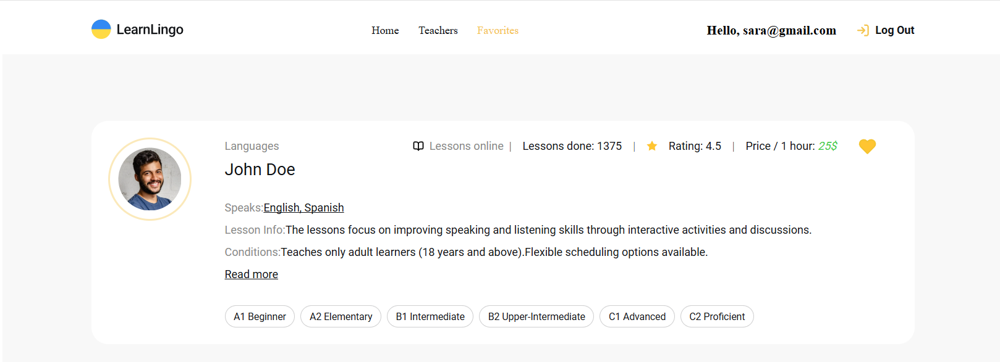

# Learn Lingo

## 💼 Project Overview:

**Learn Lingo** is a cutting-edge web application designed to connect users with language tutors from around the globe.

## 🛠 Tech Stack:

- ⚛️**React** — for building dynamic user interfaces.
- 🎯**Redux Toolkit** — for state management for better performance and scalability.
- 🖌️**CSS Modules** — scoped styling for better maintainability.
- 🗃 **Redux Persist** - Ensuring state persistence across sessions.
- 🔥 **Firebase** - Powering authentication and real-time database services.

## 🚀 Quick Start:

Follow these steps to set up and run the project locally:

Clone the repository:

git clone https://github.com/Myrosya-fsd/learn-lingo
Navigate to the project directory:

Navigate to the project directory:
cd learn-lingo

npm install
Start the development server:

npm run dev
Access the application: Open your browser and navigate to http://localhost:5173

📷 Screenshot:

🏠 Home Page:

👩‍🏫 Teachers Page:

⭐ Favorites Page:

👨‍💻 Author:
Developed by Myroslava Havrylchuk
📧 Email: myroslavahavrylchuk@gmail.com
🔗 GitHub: Myrosya-fsd
